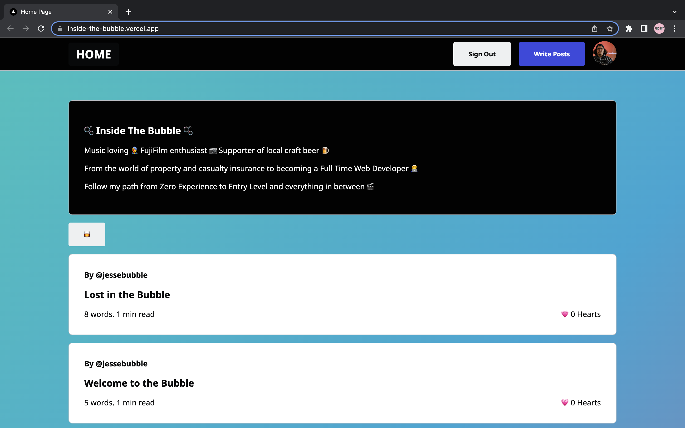
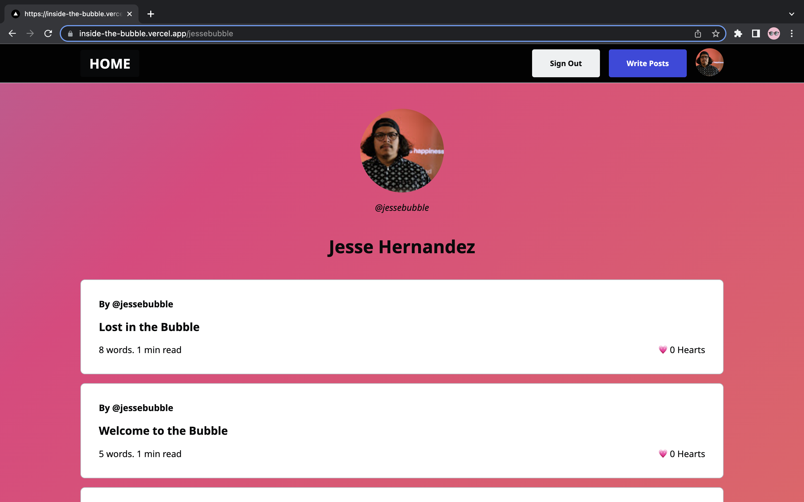
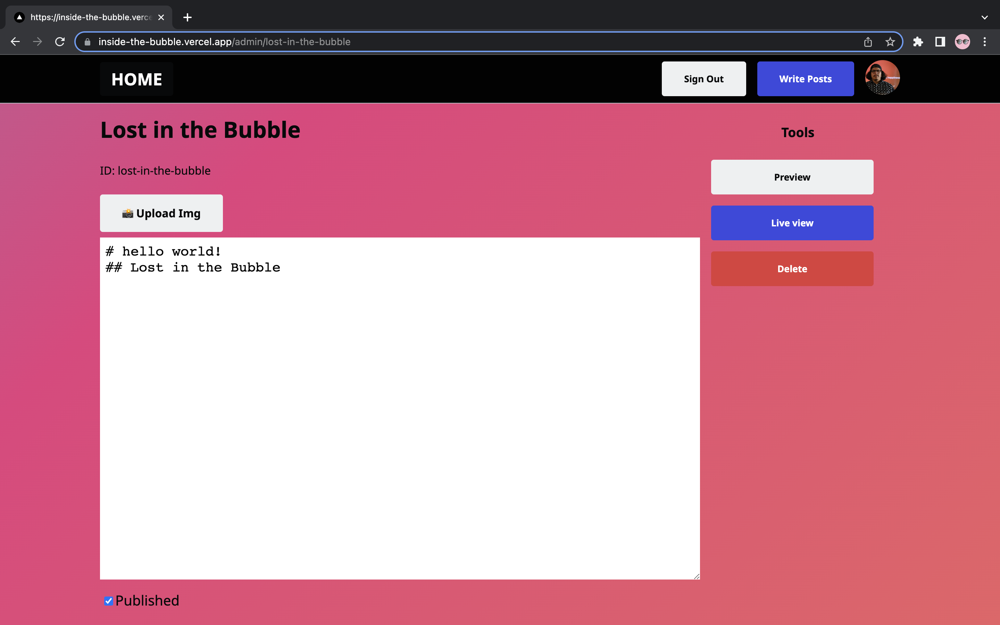

# Inside The Bubble - Blog Edition
- This app is built with Next.js and Firebase and is loosely inspired by Dev.to
- From the world of property and casualty insurance to becoming a Full Time Web Developer 🧑‍💻
- Follow my path from Zero Experience to Entry Level and everything in between 🎬

## Sample 
* [Live Demo - View My Blog!](https://inside-the-bubble.vercel.app) 🚀 





## Getting Started
This is a [Next.js](https://nextjs.org/) project bootstrapped with [`create-next-app`](https://github.com/vercel/next.js/tree/canary/packages/create-next-app).

First, run the development server:

```bash
npm run dev
# or
yarn dev
```

Open [http://localhost:3000](http://localhost:3000) with your browser to see the result.

## Resources 
* [React](https://reactjs.org/)
* [NextJS](https://nextjs.org/)
* [TypeScript](https://www.typescriptlang.org/)
* [FireBase](https://firebase.google.com/docs)
* [LoDash](https://lodash.com/)
* [React Hot Toast](https://react-hot-toast.com/)
* [React Hook Form](https://react-hook-form.com/)
* [React MarkDown](https://github.com/remarkjs/react-markdown)
* [Fireship](https://www.youtube.com/c/Fireship)
* [Vercel](https://vercel.com/)